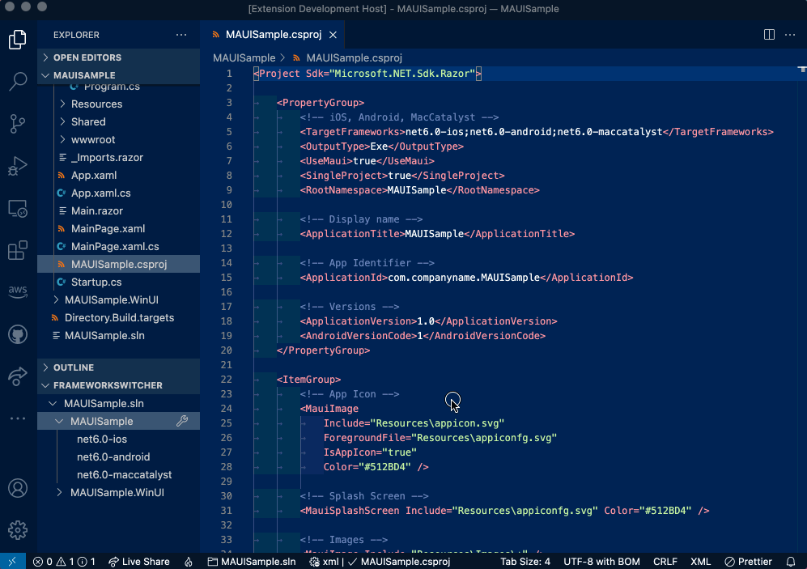

# TargetFrameworksSwitcher for OmniSharp

This extension improves the efficiency of development for projects where multiple TargetFramework are defined.

Currently, OmniSharp which is used to analyze C# code in VSCode, is set to analyze the first TargetFramework when multiple TargetFrameworks are defined.

https://github.com/OmniSharp/omnisharp-roslyn/blob/da1e65b1e2badf80adc7db8ccd37e4cf253ca7b2/src/OmniSharp.MSBuild/ProjectLoader.cs#L166-L182

If you set the value of TargetFramework, it will take precedence over it.
This extension makes it easy to set that up.

## Features

### Switch Target Framework

### Initialize Extension

## Notes

This extension adds `TargetFrameworkSwitcher.targets` file to project directory.
Since this file overrides default __TargetFramework__, it is recommended that you add that file to gitignore so that it does not change the behavior in CI or other contributors.
